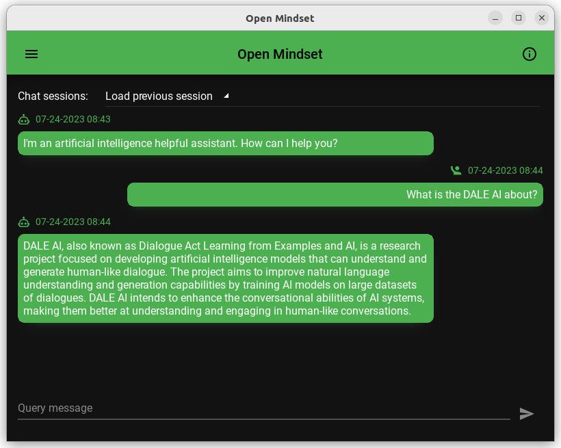

# Open Mindset app

A 💯% `Python` application using the `KivyMD` framework, integrating Artificial Intelligence features. The goal is to have a single `Python` codebase that can be built and deployed on all major native platforms: `Android`, `iOS`, `macOS`, `Linux` and `Windows`.

Some of the goals of the app:

- `KivyMD` app skeleton pattern including classique UI elements (navbar menu, top navbar, responsive, material design...)
- learn and demonstrate best programming practices in a 💯% `Python` development environment
- experiment with a lot of AI-related stuff
  - `OpenAI` `ChatGPT` API
  - `Stability AI` `text to image` API
  - plus more AI useful examples in a mobile/native app context
- document recipes for building artifacts of specific native OS
- have concrete examples of broadcasting events and react to these events through an MVC pattern
- and much more as we experiment with nice AI and existing technologies and other open-source libraries...

   

* Some screen captures of the implemented features

Platform     | About screen | Chat session | Settings
------------ | ------------ | ------------ | -------------- |
Android      |  |  | 
iOS          |  |  | 
Linux        |  |  | 
Windows      |  |  | 
macOS        |  |  | 


## Table of content

- [Open Mindset app](#open-mindset-app)
  - [Table of content](#table-of-content)
  - [Getting Started](#getting-started)
    - [Startup \& hot reload](#startup--hot-reload)
    - [Simulating a mobile device on desktop](#simulating-a-mobile-device-on-desktop)
  - [Utilities](#utilities)
    - [Preview list of Material Design implemented icons](#preview-list-of-material-design-implemented-icons)
    - [DB Browser for SQLite](#db-browser-for-sqlite)
    - [Snippet to see the layout border of any widget](#snippet-to-see-the-layout-border-of-any-widget)
  - [Managing development environment](#managing-development-environment)
    - [Python on MacOS with brew](#python-on-macos-with-brew)
    - [Certify installation](#certify-installation)
    - [Virtual environment](#virtual-environment)
    - [Dependency libraries (update, freeze them or install from)](#dependency-libraries-update-freeze-them-or-install-from)
      - [References](#references)
  - [Build for Android](#build-for-android)
    - [Building for Android on Linux Ubuntu](#building-for-android-on-linux-ubuntu)
      - [References](#references-1)
    - [Building for Android on macOS](#building-for-android-on-macos)
      - [Reference](#reference)
  - [Building for iOS](#building-for-ios)
    - [iOS build issues and solution (or workarounds)](#ios-build-issues-and-solution-or-workarounds)
  - [About Kivy framework](#about-kivy-framework)
  - [About the app name](#about-the-app-name)


## Getting Started

<div style="opacity: .5;">
You may have some OS core dependencies to install (`dll` on Windows, system lib on Ubuntu, etc.) so follow the official Kivy install instructions depending on your operating system(s):

- [Kivy Framework](https://kivy.org)
- [KivyMD](https://kivymd.readthedocs.io)

Example: for Ubuntu you have to set the following environnement variable
   ```shell
    export USE_X11=1
   ```
and install the listed [OS libraries](https://kivy.org/doc/stable/installation/installation-linux.html#id1)
</div>

### Other users can start here :point_down:

Then you can install the Open Mindset app dependencies as follow. First create and activate your virtual environment:

   ```shell
    python -m venv venv
    . venv/bin/activate
   ```

Use `pip-tools` to generate `requirements.txt` file from `requirements.in`:

   ```shell
    python -m pip install pip-tools
    pip-compile requirements.in
   ```

Update the virtual environment dependencies:

   ```shell
   pip-sync
   ```

### Startup & Hot Reload

Normal startup

    python main.py

With hot-reload enabled

    DEBUG=1 python main.py

Know issue in `DEBUG` mode:

- Pressing the *space bar* from the query textinput field of the chat session triggers an unexpected hot reload event.

### Simulating a mobile device on desktop

Normal startup

    MOBILE_SIMULATION=1 python main.py

Combined with hot-reload

    DEBUG=1 MOBILE_SIMULATION=1 python main.py

## Utilities

### Preview list of Material Design implemented icons

    python scripts/icons/main.py

### DB Browser for SQLite

This native Python app makes usage of SQLite3 as it's persistence mechanism (preferences, chat session...). Although you can visualize raw data using command lines like `sqlite3 chat_sessions.db` we recommand using the [DB Browser for SQLite](https://sqlitebrowser.org/) which is a high quality, visual, open source tool to create, design, and edit database files compatible with SQLite.

### Snippet to see the layout border of any widget

Inside the `.kivy` file just add this:

```
    canvas.before:
        Color:
            rgba: 0, 1, 0, 1
        Line:
            width: 1
            rectangle: self.x, self.y, self.width, self.height
```

## Managing development environment

### Python on MacOS with brew

Some usefull brew commands

    brew update
    brew config
    brew leaves | xargs brew desc --eval-all
    brew cleanup

    brew install cython
    echo 'export PATH="/opt/homebrew/opt/cython/bin:$PATH"' >> ~/.zshrc

Then change your `.zshrc` aliases as [explained here](https://apple.stackexchange.com/a/461063/364767)

### Certify installation

    python ./scripts/certificates/install_certifi.py

## Build for Android

### Building for Android on Linux Ubuntu

First install the following dependencies:

* https://kivy.org/doc/stable/installation/installation-linux.html#id1

Then install these python dependencies:

    pip-compile
    pip-sync

If `pip-sync` fails you may have to use the classic way once `requirements.txt` is generated by `pip-compile`:

    pip install -r requirements.txt

Ensure both `kivy` and `kivymd` are up to date (see below reference for more detail)

    pip install https://github.com/kivy/kivy/archive/master.zip
    pip install https://github.com/kivymd/KivyMD/archive/master.zip

    buildozer android clean
    buildozer android debug deploy run

#### References

* https://stackoverflow.com/a/76644946/704681

### Building for Android on macOS

    python ~/Library/Python/3.8/lib/python/site-packages/buildozer init
    python ~/Library/Python/3.8/lib/python/site-packages/buildozer android debug deploy run

    python ~/Library/Python/3.11/lib/python/site-packages/buildozer init
    python ~/Library/Python/3.11/lib/python/site-packages/buildozer android debug deploy run

- Ugly workaround for [ssl issue](https://github.com/kivy/kivy/issues/5784):
  code /Library/Frameworks/Python.framework/Versions/Current/lib/python3.10/ssl.py

- sdkmanager path does not exist, [sdkmanager is not installed](https://github.com/kivy/buildozer/issues/927#issuecomment-533020886)

#### Reference

* https://kivy.org/doc/stable/guide/packaging-android.html


## Building for iOS

### Step 1: install kivy-ios
```
pip install kivy-ios
```

### Step 2: Create KivyBuild directory to hold the Xcode project
This directory should be seperate from where this repo is stored. For example

Directory
```sh
    _environments/
        venv/
    kivyBuilds/
    poc-mobile-python/
        main.py
```


Note:
- Contributors are welcome to do this one, collected below some beginning instructions with some issues and solutions.

Good article here:
- https://nrodrig1.medium.com/put-kivy-application-on-iphone-update-1cda12e79825

Directories structure (according to medium article above)
```sh
    _environments/
        venv_wshKivy/
    kivyBuilds/
        build/
        dist/
        openmindset-ios/
    openmindset/
```

- toolchain commands:
```sh
    toolchain status
    toolchain build libffi
    toolchain build ffpyplayer
    toolchain build pillow
    toolchain build python3 kivy

    toolchain pip install kivymd
    toolchain pip install kaki
    toolchain pip install watchdog
    toolchain pip install event_bus
```

Build notes and frequently used commands:

- we must clone the app from github *WITHOUT* `venv` (wipe the `venv` folder entirely in order to build ios stuff)
- when doing small code changes within the app, here are the steps to re-create the XCode Project:

```sh
    rm -rf openmindset-ios
    toolchain create openmindset /Users/andre.masson/git/perso/python-projects/openmindset
    cp /Users/andre.masson/git/perso/python-projects/openmindset/data/icon.png openmindset-ios/
    open openmindset-ios/openmindset.xcodeproj
```

### iOS build issues and solution (or workarounds)

- [creating a custom VSCode Rosetta terminal](https://dev.to/markwitt_me/creating-a-custom-vscode-terminal-profile-for-using-rosetta-on-an-m1-mac-apple-silicon-2gb2) However I discovered that the raw macOS terminal (see link below) was working in all cases while I had some obscur issues with the VSCode Rosetta terminal so be carefull
- [launch macOS terminal in Rosetta mode](https://apple.stackexchange.com/a/409774/364767)
- [command to know current rosetta mode](https://stackoverflow.com/a/67690510/704681) (1 === rosetta, 0 !== rossetta)
    - `sysctl -n sysctl.proc_translated`
    - `arch`
      - will display `arm64` for ARM architecture
      - will display `x86_64` (or `i386`) for rosetta architecture
- Very slow `iOS Simulator` [discussed here](https://stackoverflow.com/questions/59570740/bad-xcode-iphone-simulator-performance-python-kivy-app)
- duplicate symbol about `libsdl2_ttf.a` and `libfreetype.a`
  - https://github.com/kivy/kivy-ios/issues/787#issuecomment-1489027427
    Since `sdl2_ttf` now builds its own version of `libfreetype`, we will need to update some of our recipes accordingly.
    as a workaround, you're likely good to just remove `libfreetype.a` from "Frameworks, Libraries and embedded content"

For some reason you may have to downgrade cython for kivy build to succeed. The cython specific version to use:

	pip install cython==0.29.36

Bypass macOS default built in python version:

     sudo ln -fs /Library/Frameworks/Python.framework/Versions/3.10/bin/python3 /usr/local/bin/python

XCode build failure

    rsync warning: some files vanished before they could be transferred (code 24) at /AppleInternal/BuildRoot/Library/Caches/com.apple.xbs/Sources/rsync/rsync-54.120.1/rsync/main.c(996) [sender=2.6.9]
    Command PhaseScriptExecution failed with a nonzero exit code

Solution from [here](https://github.com/kivy/kivy-ios/issues/513#issuecomment-646689846)

    % cd
    % toolchain build python3 kivy openssl
    % toolchain create <my_app_name> <full_path_to_my_app_source_directory>
    % open <my_app_name>-ios/<my_app_name>.xcodeproj


## About Kivy framework

Why is Kivy not popular?

Basically runs on donation from people like you and me and some organisations and this is unlike other frameworks that are (or were) backed by giants like Google (Flutter) or Facebook (React Native). So, Kivy might lack marketing funds, making it less popular among other frameworks but it's still a preferred choice in Python ecosystem.

## About the app name

By definition:
> An open mindset is a tendency to be receptive to new ideas and information. Having an open mindset means being objective when approaching new things, listening to other points of view, and being willing to admit what you don't know.

I decided to give it that name since this is my life philosophy and I was looking for a real project to learn `Python` language.

## Official related websites

- [Kivy Framework](https://kivy.org)
- [KivyMD](https://kivymd.readthedocs.io)
