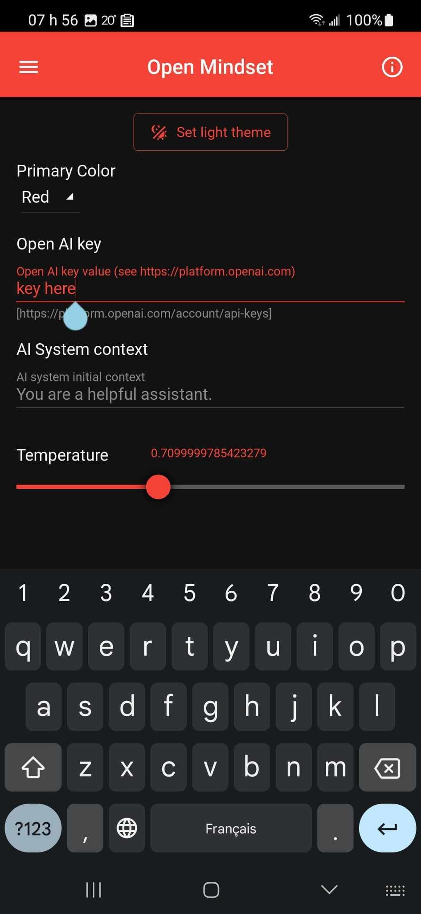

# Open Mindset app

Mobile python application

Application developed in Python using KivyMD

 

* Some screen captures of the implemented features

Platform     | About screen | Chat session | Settings
------------ | ------------ | ------------ | -------------- |
Android      |  |  | 
macOS        |  |  | 
iOS          | stay tuned 📺 | stay tuned 📺 | stay tuned 📺
Windows      | stay tuned 📺 | stay tuned 📺 | stay tuned 📺
Linux        | stay tuned 📺 | stay tuned 📺 | stay tuned 📺


## Table of content

- [Open Mindset app](#open-mindset-app)
  - [Table of content](#table-of-content)
  - [Utilities](#utilities)
    - [Preview list of MD icons](#preview-list-of-md-icons)
    - [Startup \& hot reload](#startup--hot-reload)
    - [Simulating a mobile device on desktop](#simulating-a-mobile-device-on-desktop)
    - [DB Browser for SQLite](#db-browser-for-sqlite)
    - [Snippet to see the layout border of any widget](#snippet-to-see-the-layout-border-of-any-widget)
  - [Managing development environment](#managing-development-environment)
    - [Python \>= 3.9 on MacOS](#python--39-on-macos)
    - [Changing default python executable using simlink](#changing-default-python-executable-using-simlink)
    - [Current requirements (freeze them or install from)](#current-requirements-freeze-them-or-install-from)
    - [Upgrade then freeze requirements](#upgrade-then-freeze-requirements)
      - [References](#references)
  - [Build for Android](#build-for-android)
    - [Building for Android on Linux Ubuntu](#building-for-android-on-linux-ubuntu)
      - [References](#references-1)
    - [Building for Android on macOS](#building-for-android-on-macos)
      - [Reference](#reference)


## Utilities

### Preview list of MD icons

    python utils/icons/main.py

### Startup & hot reload

Normal startup

    python main.py

With hot-reload enabled

    DEBUG=1 python main.py

Know issue in `DEBUG` mode:

- Pressing the *space bar* from the query textinput field of the chat session triggers an unexpected hot reload event.

### Simulating a mobile device on desktop

Normal startup

    MOBILE_SIMULATION=1 python main.py

Combined with hot-reload

    DEBUG=1 MOBILE_SIMULATION=1 python main.py

### DB Browser for SQLite

This native Python app makes usage of SQLite3 as it's persistence mechanism (preferences, chat session...). Although you can visualize raw data using command lines like `sqlite3 chat_sessions.db` we recommand using the [DB Browser for SQLite](https://sqlitebrowser.org/) which is a high quality, visual, open source tool to create, design, and edit database files compatible with SQLite.

### Snippet to see the layout border of any widget

Inside the `.kivy` file just add this:

```
    canvas.before:
        Color:
            rgba: 0, 1, 0, 1
        Line:
            width: 1
            rectangle: self.x, self.y, self.width, self.height
```

## Managing development environment

### Python >= 3.9 on MacOS

    brew update
    brew install python3
    brew upgrade python3

    brew install cython
    echo 'export PATH="/opt/homebrew/opt/cython/bin:$PATH"' >> ~/.zshrc

### Changing default python executable using simlink

    brew install python@3.8
    brew link --force python@3.8

    brew install python@3.11
    brew link --force python@3.11

    sudo rm /usr/local/bin/python
    sudo ln -s /opt/homebrew/Cellar/python@3.8/3.8.17/bin/python3.8 /usr/local/bin/python
    sudo ln -s /opt/homebrew/Cellar/python@3.11/3.11.3/bin/python3 /usr/local/bin/python

### Current requirements (freeze them or install from)

    pip freeze > requirements.txt
    pip install -r requirements.txt

### Upgrade then freeze requirements

    pip install pip-review
    pip-review --local --interactive
    pip freeze > requirements.txt

#### References

* https://stackoverflow.com/a/16269635/704681


## Build for Android

### Building for Android on Linux Ubuntu

First install the following dependencies:

* https://kivy.org/doc/stable/installation/installation-linux.html#id1

Then install these python dependencies:

    pip install -r requirements-linux-ubuntu.txt

Ensure both `kivy` and `kivymd` are up to date (see below reference for more detail)

    pip install https://github.com/kivy/kivy/archive/master.zip
    pip install https://github.com/kivymd/KivyMD/archive/master.zip

    buildozer android clean
    buildozer android debug deploy run

#### References

* https://stackoverflow.com/a/76644946/704681

### Building for Android on macOS

    python ~/Library/Python/3.8/lib/python/site-packages/buildozer init
    python ~/Library/Python/3.8/lib/python/site-packages/buildozer android debug deploy run

    python ~/Library/Python/3.11/lib/python/site-packages/buildozer init
    python ~/Library/Python/3.11/lib/python/site-packages/buildozer android debug deploy run

- Ugly workaround for [ssl issue](https://github.com/kivy/kivy/issues/5784):
  code /Library/Frameworks/Python.framework/Versions/Current/lib/python3.10/ssl.py

- sdkmanager path does not exist, [sdkmanager is not installed](https://github.com/kivy/buildozer/issues/927#issuecomment-533020886)

#### Reference

* https://kivy.org/doc/stable/guide/packaging-android.html

