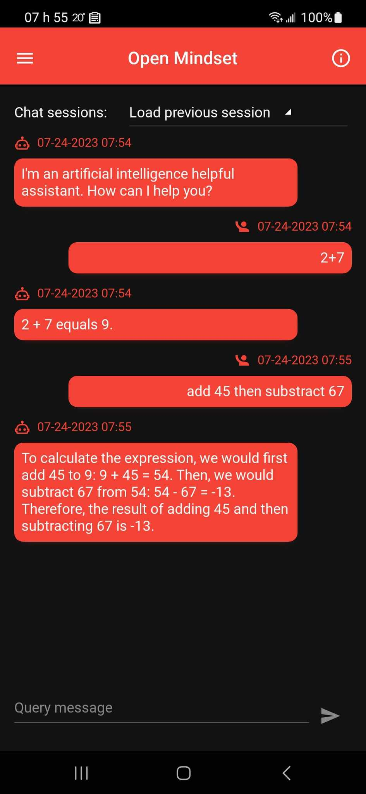
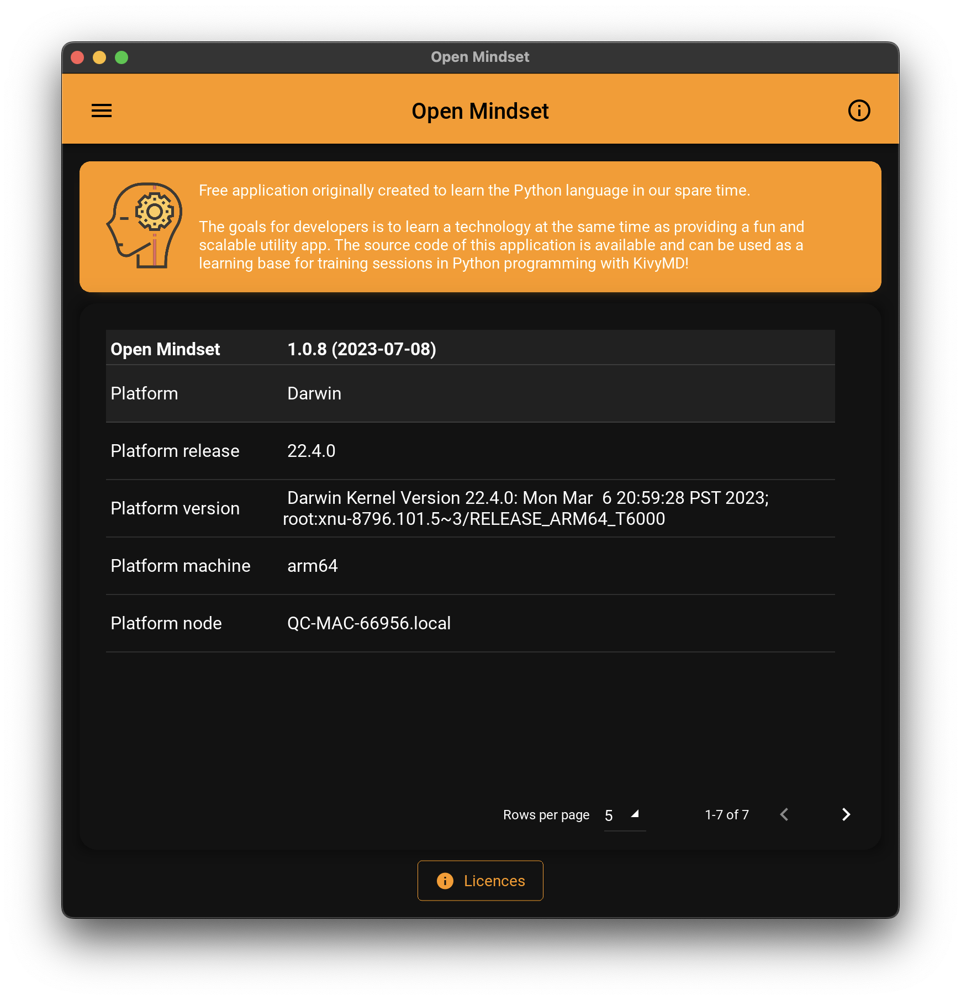

# Open Mindset app

A 💯% `Python` application using the `KivyMD` framework. The goal is to have a single `Python` codebase that can be built and deployed on all 
native platforms: `Android`, `iOS`, `macOS`, `Linux` and `Windows`.

   

* Some screen captures of the implemented features

Platform     | About screen | Chat session | Settings
------------ | ------------ | ------------ | -------------- |
Android      |  |  | 
macOS        |  |  | 
Linux        |  |  | 
Windows      |  |  | 
iOS          | stay tuned 📺 | stay tuned 📺 | stay tuned 📺


## Table of content

- [Open Mindset app](#open-mindset-app)
  - [Table of content](#table-of-content)
  - [Getting Started](#getting-started)
    - [Startup \& hot reload](#startup--hot-reload)
    - [Simulating a mobile device on desktop](#simulating-a-mobile-device-on-desktop)
  - [Utilities](#utilities)
    - [Preview list of Material Design implemented icons](#preview-list-of-material-design-implemented-icons)
    - [DB Browser for SQLite](#db-browser-for-sqlite)
    - [Snippet to see the layout border of any widget](#snippet-to-see-the-layout-border-of-any-widget)
  - [Managing development environment](#managing-development-environment)
    - [Python on MacOS with brew](#python-on-macos-with-brew)
    - [Virtual environment](#virtual-environment)
    - [Dependency libraries (update, freeze them or install from)](#dependency-libraries-update-freeze-them-or-install-from)
      - [References](#references)
  - [Build for Android](#build-for-android)
    - [Building for Android on Linux Ubuntu](#building-for-android-on-linux-ubuntu)
      - [References](#references-1)
    - [Building for Android on macOS](#building-for-android-on-macos)
      - [Reference](#reference)
    - [Building for iOS](#building-for-ios)


## Getting Started

In order to start using the app in interpreted or development mode, you must first install the Kivy framework on your computer. Once you have installed Kivy, you can install KivyMD:

- Install [Kivy Framework](https://kivy.org)
- Install [KivyMD](https://kivymd.readthedocs.io)

Then you can install the Open Mindset app dependencies as follow (depending on your development platform)

    pip install -r requirements.txt
or

    pip install -r requirements-linux-ubuntu.txt

### Startup & hot reload

Normal startup

    python main.py

With hot-reload enabled

    DEBUG=1 python main.py

Know issue in `DEBUG` mode:

- Pressing the *space bar* from the query textinput field of the chat session triggers an unexpected hot reload event.

### Simulating a mobile device on desktop

Normal startup

    MOBILE_SIMULATION=1 python main.py

Combined with hot-reload

    DEBUG=1 MOBILE_SIMULATION=1 python main.py

## Utilities

### Preview list of Material Design implemented icons

    python utils/icons/main.py

### DB Browser for SQLite

This native Python app makes usage of SQLite3 as it's persistence mechanism (preferences, chat session...). Although you can visualize raw data using command lines like `sqlite3 chat_sessions.db` we recommand using the [DB Browser for SQLite](https://sqlitebrowser.org/) which is a high quality, visual, open source tool to create, design, and edit database files compatible with SQLite.

### Snippet to see the layout border of any widget

Inside the `.kivy` file just add this:

```
    canvas.before:
        Color:
            rgba: 0, 1, 0, 1
        Line:
            width: 1
            rectangle: self.x, self.y, self.width, self.height
```

## Managing development environment

### Python on MacOS with brew

    brew update
    brew install python@3.10

    brew install cython
    echo 'export PATH="/opt/homebrew/opt/cython/bin:$PATH"' >> ~/.zshrc

Then change your `.zshrc` aliases as [explained here](https://apple.stackexchange.com/a/461063/364767)

### Virtual environment

We can manually delete the `venv` folder and recreate it whenever necessary

    python3 -m venv venv
    . venv/bin/activate

### Dependency libraries (update, freeze them or install from)

    pip install pip-review
    pip-review --local --interactive
    pip freeze > requirements.txt
    pip install -r requirements.txt

#### References

* https://stackoverflow.com/a/16269635/704681


## Build for Android

### Building for Android on Linux Ubuntu

First install the following dependencies:

* https://kivy.org/doc/stable/installation/installation-linux.html#id1

Then install these python dependencies:

    pip install -r requirements-linux-ubuntu.txt

Ensure both `kivy` and `kivymd` are up to date (see below reference for more detail)

    pip install https://github.com/kivy/kivy/archive/master.zip
    pip install https://github.com/kivymd/KivyMD/archive/master.zip

    buildozer android clean
    buildozer android debug deploy run

#### References

* https://stackoverflow.com/a/76644946/704681

### Building for Android on macOS

    python ~/Library/Python/3.8/lib/python/site-packages/buildozer init
    python ~/Library/Python/3.8/lib/python/site-packages/buildozer android debug deploy run

    python ~/Library/Python/3.11/lib/python/site-packages/buildozer init
    python ~/Library/Python/3.11/lib/python/site-packages/buildozer android debug deploy run

- Ugly workaround for [ssl issue](https://github.com/kivy/kivy/issues/5784):
  code /Library/Frameworks/Python.framework/Versions/Current/lib/python3.10/ssl.py

- sdkmanager path does not exist, [sdkmanager is not installed](https://github.com/kivy/buildozer/issues/927#issuecomment-533020886)

#### Reference

* https://kivy.org/doc/stable/guide/packaging-android.html


### Building for iOS

Follow the instructions for packing your application from the [Kivy official online documentation](https://kivy.org/)

