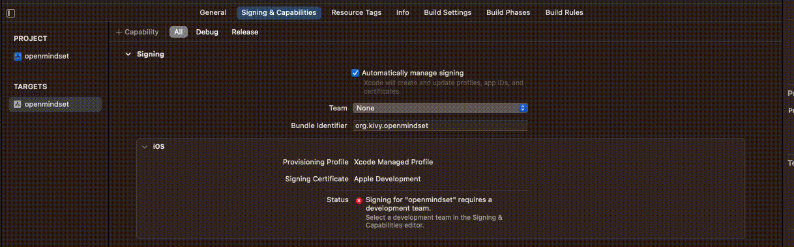
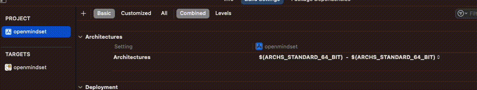
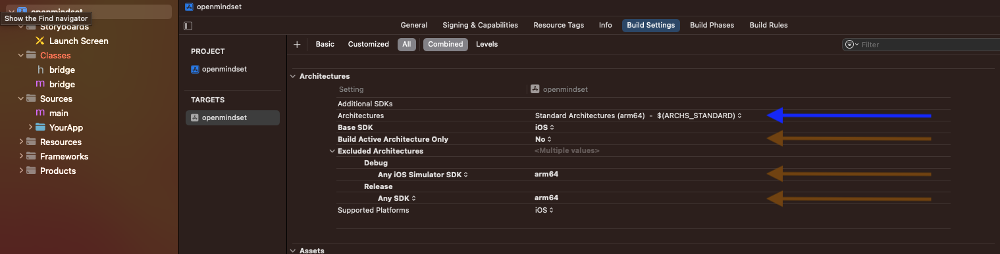

# Build iOS on M1

## Step 1: Create venv
```
 python -m venv mindset
 source mindset/bin/activate
```

The requirements.in in ios_build_01 has been modified to include:
* kivy==2.2.1
* pygame
```
 python -m pip install pip-tools
 pip-compile requirements.in
```
```
pip-sync
```

## Step 2: kivy-ios
Install kivy-ios to pip environment:
```
pip install kivy-ios
```

## Step 3: Create toolchain environment
After adding kivy-ios to your venv (I called mine mindset), create another diretory that will store the Xcode builds from the toolchain software package.

Navigate into KivyBuilds (name of directory I am using to store Xcode project and the toolchain environment).

A file structure I use for this work is
```
_environments/
    mindset/
KivyBuilds/
    # toolchain environment will go here
poc-mobil-python/
```

From inside KivyBuilds/ create the toolchain environemnt
```
toolchain build python3 kivy pillow libffi ffpyplayer 
```
This takes about 20 minutes with a good internet connection.

```
toolchain pip install kivymd kaki watchdog event_bus 
```

### Background on toolchain/ kivy-ios
toolchain is both the (1) command and (2) pacakge/suite/collection of software availible in kivy-ios package. toolchain suite of software will will convert the python project (poc-mobile-python) to an Xcode project.

## Step 4: Create Xcode proejct
Again from inside your KivyBuilds/ do the following command:
```
toolchain create openmindset /Users/nick/Documents/poc-mobile-python
```
Here openmindset could be anything and the last argument is the path to the Python Kivy project.

## Step 5: Signin to Xcode

Sign in with your [Apple Developer account](https://developer.apple.com/programs/)
 


## Step 6: Xcode Settings
**From here on down this is based on one project on a Mac M1 that sucessfully builds to my iPhone**

### 6a. Architectures
Go to Project > Architectures > Architectures
- Default setting: $(ARCHS_STANDARD_64_BIT) - ($ARCHS_STANDARD_64_BIT)
- New setting: Standard Architectures (Apple Silicon, Intel) - $(ARCHS_STANDARD)

 

<hr>
Once this architecture setting is changed and you go back to Targets > Build Settings, you should see a screen like this:

 

The blue arrow is the result of the change just made. 

The orange arrows are settings that have been suggested to be changed by articles in conversation from the kivy-ios Discord group. 

For added clairty (or confusion) these default settings (as seen in the image with the arrows) are directly from an Xcode project that **_does_** build to an iPhone.

### 6b. Build Active Architecture Only

Xcode > Targets > Build Settings > Architectures

The default "Build Active Architecture Only" (ONLY_ACTIVE_ARCH) is "NO". It has been suggested to change to "YES".

 [2022 stackoverflow comment (see 4)](https://stackoverflow.com/questions/63607158/xcode-building-for-ios-simulator-but-linking-in-an-object-file-built-for-ios-f/64139830#64139830) 

** Default meaning, setting after the toolchain build

### 6c. Excluded Architectures

Xcode > Targets > Build Settings > Architectures

The default "Excluded Architectures" (EXCLUDED_ARCHS)  is "arm64" - in both lines. This aligns with both these articles that respond to the error I am getting:
- [2021 Article](https://narlei.com/development/apple-m1-xcode-error-when-build-in-simulator/)
- [2022 Stackoverflow comment](https://stackoverflow.com/a/63955114/11925053)

It has also been recommended to me that "arm64" should be removed. So I have also tried removing these lines but still doesn't resolve the problem for Xcode projects that don't build already.