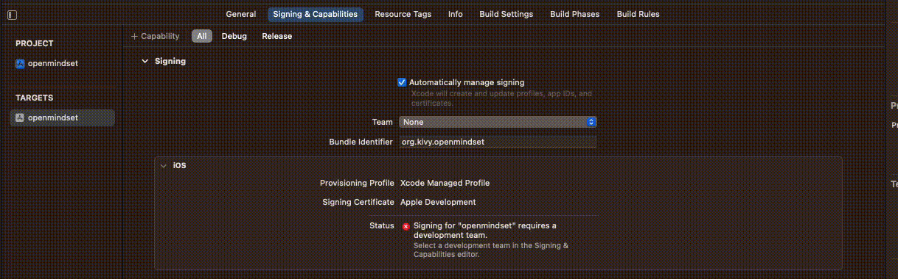

# Build iOS
Key notes for these build instructions:
- toolchain (kivy-ios): is active with the python venv is active AND your are in the direcotry that it is installed in.
- These instructions are based on building on arm64 architecture. However, I do not think there is a difference if x86_64 arch is used (as of October 2023). In the past there have been differences.

## Current iOS TestFlight version
For those interested in seeing the latest version you can download it now to your iPhone.
1. [Download](https://testflight.apple.com/join/1gCPBjbZ) iOS TestFlight app.
2. Download Open Mindset iOS from TestFlight app. 
    - The link above will both download TestFlight to your iOS device and then provide the option to download the latest Open Mindset version for testing on your iPhone.


## Step 1: Create and activate venv
This step is the same as [create venv](../README.md#create-venv).
```
 python -m venv mindset
 source mindset/bin/activate
```
Once mindset (or venv) is activated the environment is set to the terminal regardless of the directory your are in.

```
 python -m pip install pip-tools
 pip-compile requirements.in
```
```
pip-sync
```

## Step 2: kivy-ios
Install kivy-ios to pip environment:
```
pip install kivy-ios
```

## Step 3: Create toolchain environment
After adding kivy-ios to your venv (I called mine mindset), create another diretory that will store the Xcode builds from the toolchain software package.

Navigate into KivyBuilds (name of directory I am using to store Xcode project and the toolchain environment).

A file structure I use for this work is
```
_environments/
    mindset/
KivyBuilds/
    # toolchain environment will go here
poc-mobil-python/
```


From inside KivyBuilds/ create the toolchain environemnt
```
toolchain build python3 kivy pillow libffi ffpyplayer 
```
This takes about 20 minutes with a good internet connection.

```
toolchain pip install kivymd kaki watchdog event_bus 
```

### Key Note on toolchain environment
toolchain commands are particlar to the folder where toolchain packages are installed. The gif below demonstrates how your toolchain environment works. Once inside the folder where Step 3 is executed (i.e. KivyBuilds in the file structure example), if you do `toolchain status` you will see all the packages installed. However, if you naviagate outside of that folder toolchain status will return no install pacakges.

 

### Background on toolchain/ kivy-ios
toolchain is both the (1) command and (2) pacakge/suite/collection of software availible in kivy-ios package. toolchain suite of software will will convert the python project (poc-mobile-python) to an Xcode project.

## Step 4: Create Xcode project
Again from inside your KivyBuilds/ do the following command:
```
toolchain create openmindset ~/Documents/poc-mobile-python
```
Here openmindset could be anything and the last argument is the path to the Python Kivy project.

## Step 5: Signin to Xcode

Sign in with your [Apple Developer account](https://developer.apple.com/programs/)
 

## Step 6: Build to simulator or iPhone
Select device and press the play button

## Build to TestFlight
1. From inside Xcode select Product menu > Archive
    - This creates a file that will be submitted to App Store Connects
2. After Archive (.xcarchive file) is created select the file from Oragnizer and click "Distribute App".
    - This can also be accessed by Window menu > Organizer
3. There will be a automated process of verifying the package meets Apple requirements
    - one issue we have had is a binary that is not accepted from the toolchain environment. The remedy to this is just delete the file and the package will get accepted.
        - File to delete: KivyBuilds/dist/root/python3/lib/python3.10/site-packages/_watchdow_fsevents.cpython-310-darwin.so
